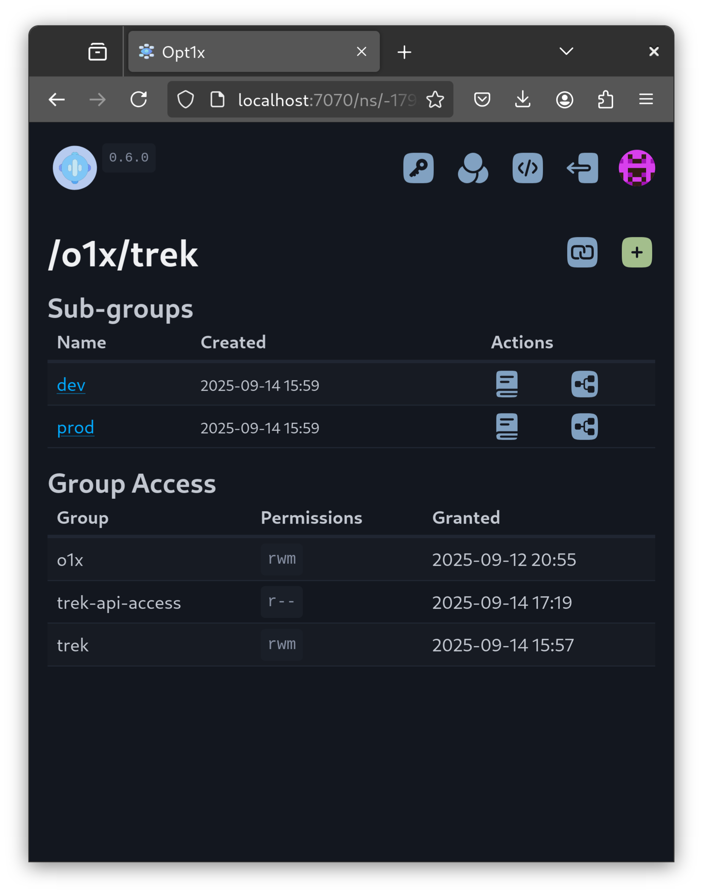
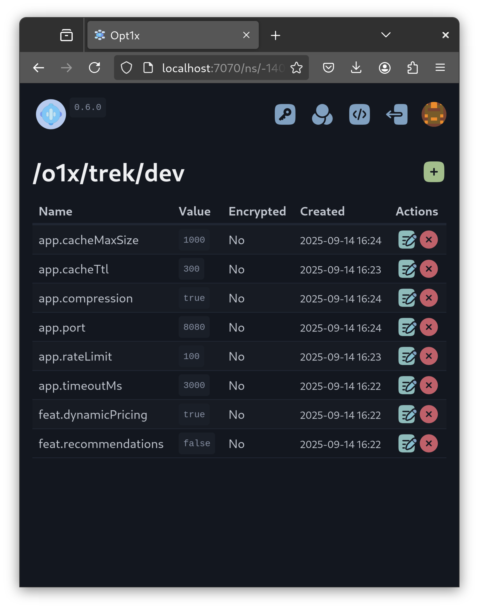
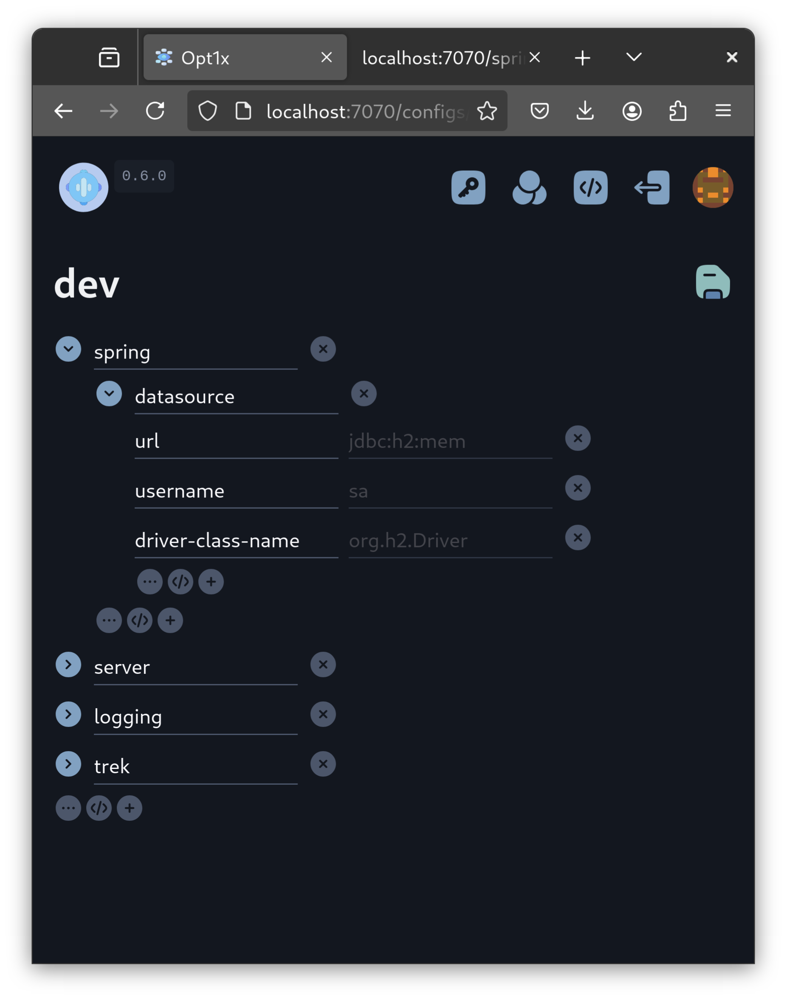

# Opt1x

Opt1x is a minimal configuration management system that treats configs as first-class citizens.

It groups related values into namespaces and allows structured builds of environment-specific configs (e.g., `dev`, `stage`, `prod`). 

This reduces technical debt by making configs explicit, searchable, and less prone to forgotten or risky changes.

It focuses on simplicity: API-key based access, namespaced RBAC, encrypted values, and tree-structured configs exportable as JSON/YAML/TOML/Properties.





## Quick start

Download the latest [release](https://github.com/vaccovecrana/opt1x/releases), or boot from a Docker image.

Start a local instance using H2 for storage, with Spring Cloud Config support:

```
opt1x --api-spring --jdbc-url=jdbc:h2:file:./o1x;DB_CLOSE_DELAY=-1;LOCK_MODE=3;AUTO_RECONNECT=TRUE
```

1. Save the unseal key and root API key.
2. Log in with the root key.
3. Go to http://localhost:7070
4. Click `Namespaces -> o1x`. Create namespace `/o1x/my-app`.
5. Click the `Book` icon and add some values: `db.url` (string), `db.user` (string).
6. Create a `test` config tree, binding keys to values. Let's model a Spring Boot config:
   1. Click the `</>` object button.
   2. Change `key1`  to `spring`.
   3. Click the `</>` object button again to add a nested object.
   4. Change `key1` again to `datasource`.
   5. Click the `(+)` (value reference) button, and type `db.` in the input field.
   6. Choose the `db.url` value from the dropdown.
   7. Change `key1` to `url`.
   8. Repeat from #5, now use the `db.user` value, and set a `username` key.
   9. Save the configuration tree.

Lastly, request this configuration in YAML format from a `curl` call (your Spring Boot app would do the same).

```
curl 'http://localhost:7070/spring/my-app/test.yaml' --user 'o1x:<YOUR_ROOT_API_KEY>'
spring:
  datasource:
    url: my-database.big-cloud.io
    username: myappuserdev
```

Or in JSON

```
curl 'http://localhost:7070/spring/my-app/test' --user 'o1x:<YOUR_ROOT_API_KEY>'
{
  "name": "my-app",
  "profiles": [
    "test"
  ],
  "format": "json",
  "label": "/o1x/my-app",
  "version": "1993de4b255",
  "propertySources": [
    {
      "name": "/o1x/my-app/test",
      "source": {
        "spring.datasource.url": "my-database.big-cloud.io",
        "spring.datasource.username": "myappuserdev"
      }
    }
  ]
}
```

Or as plain properties:

```
curl 'http://localhost:7070/spring/my-app/test.properties' --user 'o1x:<YOUR_ROOT_API_KEY>'
spring.datasource.url=my-database.big-cloud.io
spring.datasource.username=myappuserdev
```

Done!

This should be enough to support a single application requesting typical `dev/test/prod` profiles.

For advanced features like high availability, RBAC, integrations, etc. please [read the docs](https://vaccovecrana.github.io/opt1x).
